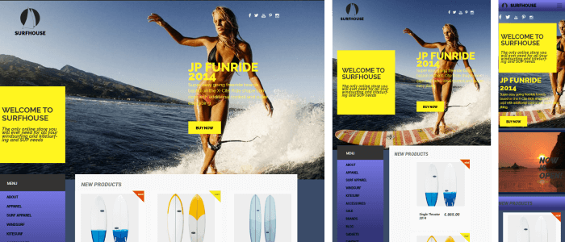

# $\color{rebeccapurple}\text{SURF-HOUSE}$

$\color{limegreen}\text{Учебная работа}$

## $\color{mediumblue}\text{Описание работы }$:

Внешняя часть главной страницы сайта, интернет магазина товаров для сёрфинга.

Работа на основе домашних заданий по курсу GeekBrains , "базовый HTML/CSS".

🎯 $\color{mediumblue}\text{Моя задача}$ - Отработка основных навыков вёрстки.

---

Макет -> [**Dounload PSD**](https://disk.yandex.by/d/nri_LB_l3Pm4wL/home.psd)

Вёрстка -> [**Git pages**]()

## $\color{mediumblue}\text{Технологии, инструменты и способы вёрстки }$:

❗Figma.
❗Adobe Ph.
❗Ceros ( _Avacode_ ).
❗VsCode.
❗Git.
❗Адаптивная вёрстка.
❗Bootstrap ( _позиционирование_ ).
❗FlexBox.
❗Grid.
❗БЭМ.
❗Семантика.
❗Мобильное "бургер-меню" (_CSS_).
❗Эффекты hover и active.

## $\color{mediumblue}\text{Темы , изучаемые в процессе работы над макетом :}$

### Курс $\color{limegreen}\text{"базовый HTML/CSS" }$:

📌 Основные понятия в Веб-разработке.

📌 Основы HTML

📌 Основы CSS.

📌 Псевдоклассы, псевдоэлементы, табличная вёрстка.

📌 Формирование блочной модели.

📌 Работа с макетом формата PSD.

📌 Разметка макета, знакомство с BOOTSTRAP.

📌 Стандарты WEB . Вспомогательные инструменты. Препроцессоры SASS, LESS.

---
